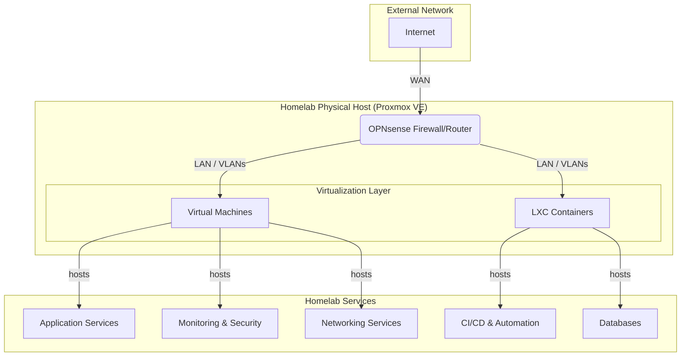

# Home Lab Infrastructure

## Overview

This repository documents my self-hosted home lab infrastructure built using Proxmox VE. The goal of this project is to reduce reliance on cloud providers by self-hosting essential services, learn enterprise-level networking and system administration, and provide a robust testing and development playground for full-stack applications and infrastructure tooling.

---

## Architecture Overview

My homelab is designed with a layered approach, emphasizing security, isolation, and scalability. It's built on a Proxmox VE hypervisor, with OPNsense acting as the core firewall and router. Services are deployed across a mix of full Virtual Machines (VMs) for isolation and lightweight Linux Containers (LXCs) for efficiency.

---

## Purpose and Motivation

- **Cost Savings**: Avoid recurring monthly fees from cloud storage and hosting platforms.
- **Control**: Full ownership over data, routing rules, and security posture.
- **Learning**: Hands-on exposure to real-world IT and DevOps concepts including:
  - Virtualization with Proxmox (VMs and LXCs).
  - Advanced routing, firewalling, and network segmentation with OPNsense.
  - CI/CD automation with GitLab Runner and Ansible.
  - Container orchestration and management with Docker and Portainer.
  - Cloud-native observability with OpenTelemetry, Grafana, Loki, and Wazuh.
  - Secure remote access using Cloudflare Tunnels and Tailscale.
- **Playground Environment**: A reliable sandbox to test, break, and rebuild services without affecting production workflows.

---

## Documentation

This repository is structured to be a comprehensive guide to my homelab. Each major component has its own detailed documentation.

*   **[Services](./docs/services.md):** A detailed inventory of all running VMs, containers, and their roles.
*   **[Networking](./docs/networking.md):** An overview of the network architecture, including OPNsense configuration, VLANs, and firewall rules.
*   **[Virtualization](./docs/virtualization.md):** Information on the Proxmox VE setup, including host configuration, storage, and management of VMs and LXCs.
*   **[CI/CD and Automation](./docs/ci-cd.md):** Details on the automation workflows, including GitLab Runner for CI/CD and Ansible for configuration management.
*   **[Monitoring](./docs/monitoring.md):** A breakdown of the observability stack, used to monitor the health and performance of the lab.

---

## Security Model

- **Zero Trust Principles:** No services are exposed directly to the internet.
- **Encrypted Access:** All remote access is routed through secure, encrypted tunnels (Cloudflare or Tailscale).
- **Firewall:** OPNsense manages all ingress and egress traffic with a strict firewall ruleset.
- **Network Segmentation:** Services are isolated on separate VLANs based on their function and trust level.
- **Security Monitoring:** Wazuh is deployed for Security Information and Event Management (SIEM) and Extended Detection and Response (XDR).

---

## License

This project is for personal use and educational purposes. Use at your own risk.