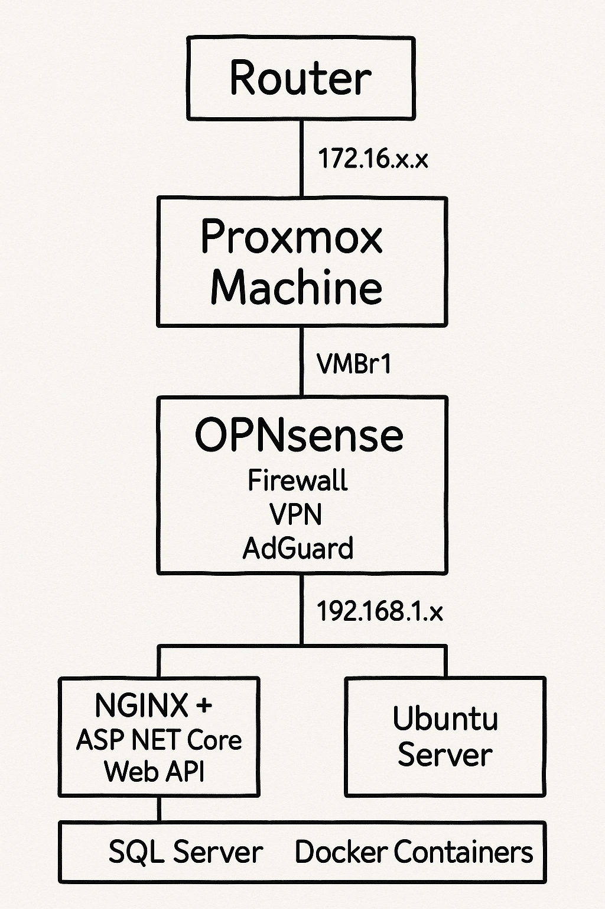

# Home Lab Infrastructure

## Overview

This repository documents my self-hosted home lab infrastructure built using Proxmox VE. The goal of this project is to reduce reliance on cloud providers by self-hosting essential services, learn enterprise-level networking and system administration, and provide a testing playground for full-stack applications and infrastructure tooling.

---

## Architecture Diagram

This diagram represents the current state of the home lab, where my ISP router provides a 172.16.1.x WAN address to the Proxmox machine. Inside Proxmox, OPNsense handles all routing, VPN, firewall, and DNS-level ad-blocking. Internal services are assigned 192.168.1.x addresses and hosted in isolated VMs.

---

## Purpose and Motivation

- **Cost Savings**: Avoid recurring monthly fees from cloud storage and hosting platforms.
- **Control**: Full ownership over data, routing rules, and security posture.
- **Learning**: Hands-on exposure to real-world IT concepts including:
  - Virtualization with Proxmox
  - Advanced routing and firewalling using OPNsense
  - Self-hosting Dockerized web applications
  - Windows Server and SQL Server administration
  - DNS filtering and VPN tunneling
- **Playground Environment**: A reliable sandbox to test, break, and rebuild services without affecting production workflows.

---

## Current Setup

- **Router**: ISP device assigning 172.16.1.x addresses
- **Proxmox Host (Dell OptiPlex)**:
  - **OPNsense VM**:
    - WAN: 172.16.1.x
    - LAN: 192.168.1.x
    - Services: WireGuard VPN, Firewall, AdGuard DNS
  - **Ubuntu Server VM**:
    - Hosts: NGINX reverse proxy, ASP.NET Core Web API
    - Docker Containers
  - **Windows Server VM**:
    - Hosts: Microsoft SQL Server

---

## Planned Expansion

1. **Router Node** (Proxmox)
   - Dedicated Dell OptiPlex with 2.5Gb NIC
   - Run OPNsense with VPN, firewall, DNS filtering

2. **Service Host Node** (Proxmox)
   - Separate machine dedicated to containerized services
   - Host full-stack apps like CloudCARE

3. **NAS Node** (Proxmox or Bare Metal)
   - Dell OptiPlex with 10GbE NIC
   - TrueNAS or Ubuntu + ZFS setup
   - Provide NFS/SMB storage for backups, media, and services

---

## Tech Stack

| Component           | Technology                      |
|---------------------|----------------------------------|
| Virtualization      | Proxmox VE                       |
| Router / Firewall   | OPNsense                         |
| VPN                 | WireGuard                        |
| DNS Filtering       | AdGuard Home                     |
| Web Hosting         | NGINX, Docker                    |
| Backend Services    | ASP.NET Core Web API             |
| Database            | SQL Server (Windows VM)          |
| NAS (Planned)       | TrueNAS / Ubuntu + ZFS           |
| Networking          | 2.5GbE (router), 10GbE (NAS)     |

---
---

## Security Model

- No services exposed directly to the internet
- All access routed through WireGuard VPN
- OPNsense manages firewall rules and DNS filtering via AdGuard
- All services run in isolated VMs or containers

---

## License

This project is for personal use and educational purposes. Use at your own risk.