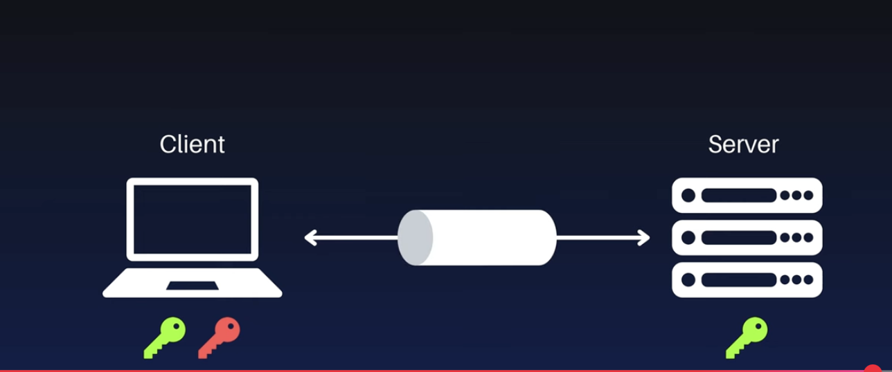

# CI/CD and Automation

Automation is a key principle of this homelab, used to ensure consistency, reduce manual effort, and create repeatable processes for both application deployment and infrastructure management. This is achieved through a combination of GitLab for CI/CD and Ansible for configuration management.

## CI/CD with GitLab Runner

A dedicated **GitLab Runner** (`gitlab-runner` LXC container) is deployed in the homelab. This runner connects to a GitLab instance (either self-hosted or on GitLab.com) and acts as a worker to execute jobs defined in `.gitlab-ci.yml` files within various project repositories.

**Key Responsibilities:**

-   **Continuous Integration (CI):** Automatically builds, tests, and validates code on every commit. This includes compiling applications, running unit and integration tests, and performing static analysis.
-   **Continuous Deployment (CD):** Automatically deploys applications to staging or production environments once they have passed the CI stage. For example, the runner can be configured to build a new Docker image, push it to a registry, and then trigger a refresh of the service in Portainer or via a webhook.
-   **Pipeline Execution:** Provides the compute resources for any automated pipeline, freeing up developer machines and ensuring a consistent build environment.

## Infrastructure as Code (IaC) with Ansible

**Ansible** (`ansible` LXC container) is the primary tool for configuration management and infrastructure automation. It uses a simple, human-readable language (YAML) to define the desired state of systems. An agentless architecture means it connects to managed nodes over standard SSH and requires no special software to be installed on them.

**Key Use Cases:**

-   **Configuration Management:** Ensures that all VMs and containers are configured in a consistent state. This includes managing packages, configuring system files, creating users, and setting security policies. If a configuration drifts from the desired state, an Ansible playbook can be run to bring it back into compliance.
-   **Application Provisioning:** Automates the deployment of applications and their dependencies. For example, an Ansible playbook can provision a new VM, install Docker, pull the necessary images, and start the application using a `docker-compose.yml` file.
-   **Orchestration:** Manages complex, multi-step workflows. For instance, a playbook could be created to perform a rolling update of a clustered application, ensuring zero downtime.



### Ansible Setup and Concepts

Ansible is an Infrastructure as Code (IaC) tool designed to automate tasks on Linux servers. It operates with a master node (the Ansible control node) that connects to multiple managed nodes (the target servers). Ansible executes "plays" (tasks) across these nodes, often in parallel.

#### SSH Connection Management

Ansible relies on SSH for connecting to and managing remote servers.

1.  **Install OpenSSH Server:**
    Ensure OpenSSH server is installed on your control node (if not already present):
    ```bash
    sudo apt install openssh-server
    ```
2.  **Initial Connection:**
    Connect to each managed server from your Ansible workstation at least once. This is to accept the initial SSH host key fingerprint (answer `yes` to the prompt).
    
    

3.  **SSH Key Authentication:**
    For secure and agentless authentication, generate an SSH key pair on the Ansible control node. The public key (`id_rsa.pub`) should then be copied to the `~/.ssh/authorized_keys` file of the user on each managed node that Ansible will control. This allows Ansible to connect without password prompts.

#### Ansible Installation

Ansible can be installed in several ways (APT, Python `pip`, or binary). The APT method is generally the easiest for Debian/Ubuntu-based systems.

#### Python Minimal Requirement

For some Ubuntu systems, a minimal Python installation might be required on the managed nodes for Ansible to function correctly (as Ansible modules are written in Python).

```bash
sudo apt update && sudo apt install -y python3 python3-six
```

#### Ansible Playbooks

Ansible's automation is defined in **playbooks**, which are YAML-formatted configuration files. Playbooks contain lists of tasks.

-   **Tasks:** Individual actions that Ansible performs. Each task uses a specific **module** to achieve its goal.
    ```yaml
    tasks:
      - name: Create node_exporter user
        user:
          name: node_exporter
          shell: /sbin/nologin
    ```
    In this example:
    -   `name`: A human-readable description of the task.
    -   `user`: The Ansible module being called.
    -   `name: node_exporter`, `shell: /sbin/nologin`: Arguments passed to the `user` module to define the desired state.

-   **Modules:** These are the units of work in Ansible. They are small programs that execute specific tasks on the managed nodes (e.g., `systemd` for services, `copy` for files, `apt` for package management, `get_url` for downloading).

-   **Roles:** For more complex and reusable automation, tasks are organized into **roles**. A role is a structured collection of tasks, variables, handlers, and templates, designed to automate the setup of a specific component (e.g., a `prometheus.prometheus.node_exporter` role would contain all tasks to install and configure Node Exporter). The hierarchy is typically: `Role` → multiple `Tasks` → each `Task` uses a `Module`.

By combining GitLab Runner for application-level CI/CD and Ansible for infrastructure-level automation, the homelab achieves a high degree of automation, making it more robust, predictable, and easier to manage.
