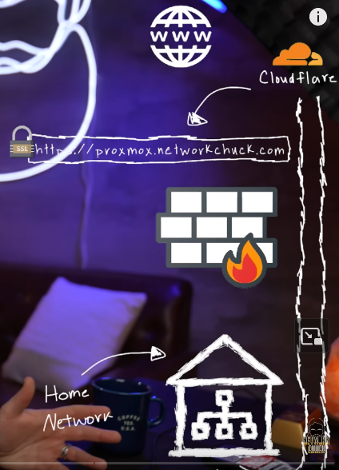
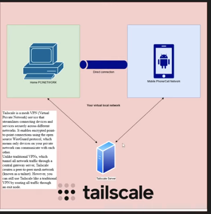

# Networking Infrastructure

The network is the backbone of the homelab, designed for security, performance, and segmentation. It is managed by an **OPNsense firewall**, which provides advanced routing, threat detection, and VPN capabilities.

## Core Components

### OPNsense Firewall

OPNsense is the central nervous system of the network. It runs as a virtual machine on the Proxmox host and is responsible for:
- **Routing:** Managing all traffic between the internal networks (VLANs) and the internet.
- **Firewall:** Implementing a strict, stateful firewall ruleset to control ingress and egress traffic. Only specific, required traffic is allowed between network segments.
- **VPN Server:** Provides secure remote access to the homelab.
- **DNS Resolution:** Handles DNS for internal clients, often with ad-blocking and filtering capabilities.

### VLANs (Virtual LANs)

To achieve network isolation, the homelab is segmented into multiple VLANs. This ensures that different types of services (e.g., production applications, testing environments, management interfaces) cannot communicate with each other unless explicitly allowed by a firewall rule. A key example is the `prod` network, which is a dedicated VLAN for production services like the CloudCare API, ensuring they are isolated from less secure environments.

## Secure Remote Access

Directly exposing services to the internet is a significant security risk. To avoid this, this homelab uses modern, secure tunneling solutions.

### Cloudflare Tunnel

A Cloudflare Tunnel (`cloudflare-connector` service) creates a secure, outbound-only connection to the Cloudflare network. This allows services, like the CloudCare API, to be accessed from the internet without opening any inbound ports on the firewall. All traffic is encrypted and routed through Cloudflare, which can provide additional security features like DDoS protection and a Web Application Firewall (WAF).



We use Cloudflare Tunnel so we don't need to expose ports on our router, allowing access to private services without punching holes in the firewall. The tunnel starts from the Cloudflare server to a Cloudflare service we install on our server. We install one connector on our server and then use Cloudflare Zero Trust to establish the tunnel.

### Tailscale VPN

Tailscale provides a zero-config mesh VPN that creates a secure, private network between all connected devices, wherever they are. A dedicated Tailscale "edge node" (`tailscale` service) runs within the homelab, acting as a gateway. This allows authorized users and devices to securely access internal homelab services as if they were on the local network, without the complexity of traditional VPN setups.



#### Tailscale Exit Node Setup (IP 192.168.1.117)

To make Tailscale an exit node for LAN access, enabling remote connections to access other VMs on your home network, perform the following steps on the Tailscale server:

1.  **Enable IP Forwarding:**
    ```bash
    echo 'net.ipv4.ip_forward = 1' | sudo tee -a /etc/sysctl.d/99-tailscale.conf
    echo 'net.ipv6.conf.all.forwarding = 1' | sudo tee -a /etc/sysctl.d/99-tailscale.conf
    sudo sysctl -p /etc/sysctl.d/99-tailscale.conf
    ```
2.  **Advertise Exit Node and Routes:**
    ```bash
    sudo tailscale set --advertise-exit-node
    sudo tailscale up
    # Then advertise your LAN network IP range
    sudo tailscale up --advertise-routes=<your LAN network IP range>/24 --reset
    ```

### WireGuard VPN Client Setup

For devices requiring a traditional VPN connection, a WireGuard client can be configured to connect to the OPNsense WireGuard server.

#### 1. Install WireGuard

```bash
sudo apt update
sudo apt install wireguard -y
```
This installs both `wg` (the core WireGuard tool) and `wg-quick` (a helper for easily starting interfaces).

#### 2. Transfer and Move the Client Config

Export the peer configuration (`wg0.conf`) from OPNsense and copy it to your client device (e.g., Raspberry Pi):

```bash
scp wg0.conf user@raspberrypi:/home/user/
```
Then move it to the WireGuard configuration directory and set appropriate permissions:
```bash
sudo mv ~/wg0.conf /etc/wireguard/
sudo chmod 600 /etc/wireguard/wg0.conf
```

#### 3. Manually Test the Connection

```bash
sudo wg-quick up wg0
sudo wg
```
You should see your interface `wg0` with a public key, port, and peer listed. To bring it down:
```bash
sudo wg-quick down wg0
```

#### 4. Enable Automatic Startup on Boot

```bash
sudo systemctl enable wg-quick@wg0
sudo systemctl start wg-quick@wg0
```
Check its status:
```bash
sudo systemctl status wg-quick@wg0
```

#### 5. Verify Connectivity

```bash
ip a show wg0
ping 10.11.11.1          # OPNsense WG tunnel IP
curl ifconfig.me         # should show OPNsense WAN IP if full-tunnel
```

#### Troubleshooting Summary

| Problem                         | Symptom / Error                                    | Fix                                                                    |
| ------------------------------- | -------------------------------------------------- | ---------------------------------------------------------------------- |
| **Missing `resolvconf`**        | `wg-quick: line 32: resolvconf: command not found` | `sudo apt install resolvconf -y` then `sudo systemctl enable --now resolvconf` |
| **Interface already exists**    | `wg-quick: wg0 already exists`                     | `sudo wg-quick down wg0` before starting the service                   |
| **No handshake (0 B received)** | Pi sends packets but no reply from OPNsense        | Add correct firewall & NAT rules on OPNsense (UDP 51820 allow + outbound NAT for WG network) |
| **Autostart not working**       | Interface not up after reboot                      | `sudo systemctl enable wg-quick@wg0`                                   |
