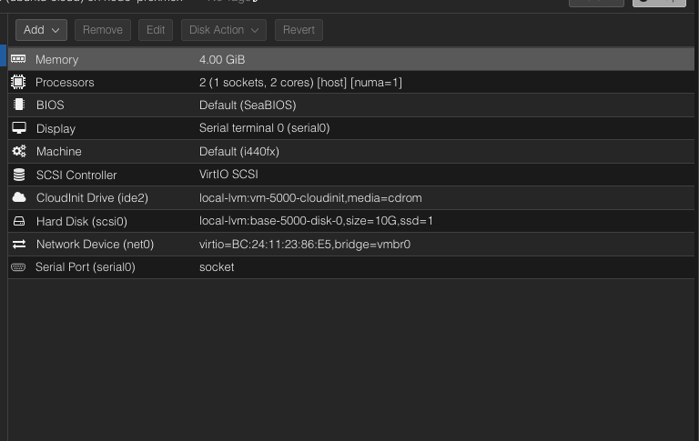

# Virtualization with Proxmox VE

The entire homelab is built upon **Proxmox Virtual Environment (VE)**, an open-source virtualization platform. It provides a robust and flexible foundation for running a wide variety of services and applications by combining two virtualization technologies: KVM for full virtual machines and LXC for lightweight containers.

## Proxmox VE Host

Proxmox VE is installed directly on bare metal hardware, turning it into a powerful hypervisor that can be managed through a web-based graphical user interface. It handles the allocation of physical resources like CPU, RAM, and storage to all the virtualized guests.

## Virtual Machines (VMs) vs. Linux Containers (LXCs)

The homelab utilizes a mix of both VMs and LXCs, chosen based on the needs of the service being deployed.

### Virtual Machines (VMs)

- **What they are:** VMs are full emulations of a physical computer, each running its own complete operating system kernel.
- **Why they are used:** VMs provide the **highest level of isolation and security**. Since each VM has its own kernel, a compromise or failure in one VM is completely isolated from the host and other VMs. This makes them ideal for:
  - Running services that require a different OS than the host (e.g., Windows Server).
  - Hosting critical infrastructure like the OPNsense firewall, where security is paramount.
  - Deploying applications with specific kernel dependencies or modules.
- **Examples in this lab:** `portainer`, `tailscale`, `wazuh`, `monitoring`, `howais` (RHEL).

### Linux Containers (LXCs)

- **What they are:** LXCs are a form of OS-level virtualization where containers share the kernel of the Proxmox host. They have their own isolated userspace, but not their own kernel.
- **Why they are used:** LXCs are **extremely lightweight and efficient**. They have significantly less overhead than VMs, meaning you can run many more of them on the same hardware. They start up almost instantly and have near-bare-metal performance. This makes them perfect for:
  - Running single applications or services that don't have complex kernel requirements.
  - Deploying databases, web servers, and other Linux-based applications.
- **Examples in this lab:** `proxymanager`, `gitlab-runner`, `postgresql`, `ansible`.

## Automated Provisioning with Cloud-Init

To streamline the creation of new virtual machines, this homelab uses **Cloud-Init**. Cloud-Init is the industry standard for the automated configuration of cloud instances. In Proxmox, it allows for the pre-configuration of new VMs from a template. This includes setting the hostname, creating users, adding SSH keys, and running scripts on the first boot. This "Infrastructure as Code" approach ensures that new VMs are provisioned in a consistent and repeatable way.



### Cloud-Init VM Template Creation

Here are the steps to create a Cloud-Init enabled VM template in Proxmox:

1.  **Download the Cloud Image:**
    Download an appropriate cloud image (e.g., Ubuntu server cloudimg-amd64.img) from a reliable source like `https://cloud-images.ubuntu.com/`.

2.  **Create the VM Shell (CLI):**
    Use the Proxmox `qm` command to create the basic VM shell.
    ```bash
    # 1) Create the VM shell
    qm create 5000 --name ubuntu-cloud --memory 2048 --cores 2 --net0 virtio,bridge=vmbr0
    ```
    (Adjust VMID `5000`, name, memory, cores, and bridge as needed.)

3.  **Import the Cloud Image Disk:**
    Import the downloaded cloud image to your Proxmox storage (e.g., `local-lvm`).
    ```bash
    # 2) Import the cloud image to local-lvm
    # (adjust IMG filename you downloaded)
    qm importdisk 5000 noble-server-cloudimg-amd64.img local-lvm
    # ↑ This creates an LV like local-lvm:vm-5000-disk-0
    ```

4.  **Attach the Imported Disk:**
    Attach the imported disk to the VM as an SCSI device.
    ```bash
    # 3) Attach the imported disk (NO .raw, NO slash)
    qm set 5000 --scsihw virtio-scsi-pci --scsi0 local-lvm:vm-5000-disk-0
    ```

5.  **Add Cloud-Init Drive and Boot Settings:**
    Configure the VM to use the Cloud-Init drive for initial setup and define boot order.
    ```bash
    # 4) Add cloud-init drive + boot settings
    qm set 5000 --ide2 local-lvm:cloudinit
    qm set 5000 --boot c --bootdisk scsi0
    qm set 5000 --serial0 socket --vga serial0
    # Optional UEFI (recommended):
    qm set 5000 --bios ovmf --efidisk0 local-lvm:1,efitype=4m,pre-enrolled-keys=1
    ```

6.  **Resize the VM Disk:**
    Resize the VM's disk to your desired size (e.g., 10GB).
    ```bash
    # 5) Resize the VM disk to the size you want (e.g., 10G)
    qm resize 5000 scsi0 10G
    ```

7.  **Convert to Template:**
    Once configured, convert the VM into a template. This allows you to rapidly deploy new VMs from this pre-configured base.
    ```bash
    # 7) Convert to template
    qm template 5000
    ```
    After conversion, you can use this template to create new VMs via the Proxmox GUI, which will then leverage Cloud-Init for customization.
